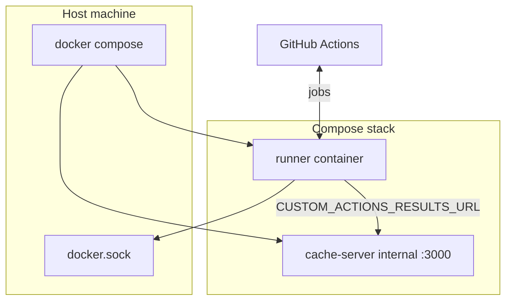

# k16-gh-agent-runner

Self-hosted GitHub Actions runner image with a pre-installed AI/CI toolchain and an optional local Actions cache server.

[](https://ghcr.io/kostua16/k16-gh-agent-runner)
[](https://github.com/kostua16/k16-gh-agent-runner/tree/main)

## Table of contents

- [What it does](#what-it-does)
- [What's in the image](#whats-in-the-image)
- [Prerequisites](#prerequisites)
- [Install](#install)
- [Managing the stack](#managing-the-stack)
- [Configuration](#configuration)
- [Build](#build)
- [Project layout](#project-layout)
- [Security](#security)

## What it does

This project provides a **Docker image** based on [falcondev-oss/actions-runner](https://github.com/falcondev-oss/actions-runner) that registers and runs as a **GitHub Actions self-hosted runner** via [`runner.sh`](runner.sh).

The image ships a **curated toolchain** (Node, Bun, `gh`, AI agent CLIs, linters, Docker CLI, and more) so workflows spend less time installing tools on every job.

Production deployment is a **two-service** Compose stack ([`docker-compose.yml`](docker-compose.yml)):

| Service | Role |
|---------|------|
| **runner** | Self-hosted runner (needs `GITHUB_URL` + `RUNNER_TOKEN`) |
| **cache-server** | [falcondev Actions cache server](https://github.com/falcondev-oss/github-actions-cache-server) for faster caching on the internal Docker network |

The runner mounts **`/var/run/docker.sock`** so workflows can run Docker-based jobs. Your host user should be in the `docker` group (or equivalent).

The cache server is **not published on the host** (no port 3000 bind). Only the `runner` service reaches it at `http://cache-server:3000/`.



## What's in the image

Versions are pinned in [`env.build`](env.build) and installed by phased scripts under [`scripts/`](scripts).

| Category | Tools (defaults) |
|----------|------------------|
| Base | GitHub Actions runner (falcondev-oss) |
| Runtime | Node.js 22, Bun 1.3.14, Python 3, **uv** |
| Package managers | npm, bun, **corepack** (pnpm / yarn) |
| CLI / quality | GitHub CLI 2.93.0, actionlint 1.7.7, **shellcheck**, **shfmt**, **make**, **yq**, git, jq, ripgrep, **openssh-client** |
| Containers | Docker CLI 28.x + Compose v2 plugin (installed if missing from base) |
| Archives | unzip, **xz-utils**, **zstd** |
| Security / lint | **hadolint**, **gitleaks** |
| AI agents (optional `INSTALL_*` build args) | GSD, RTK, OpenAI Codex CLI, Claude Code, Cursor Agent CLI, Gemini CLI, Antigravity CLI |
| Data | Prisma CLI |

API keys and account auth (`ANTHROPIC_API_KEY`, `OPENAI_API_KEY`, `CURSOR_API_KEY`, `GEMINI_API_KEY`, Google/Antigravity sign-in, etc.) are **not** baked into the image. Set them in GitHub Actions secrets or optional entries in `.env` for local testing.

To build a slimmer image, set `INSTALL_*=false` in `env.build` before `make build`.

## Prerequisites

- Linux host (**amd64** or **arm64**) with Docker Engine and **Compose v2** (`docker compose`)
- Writable access to `/var/run/docker.sock` on the host
- A GitHub **runner registration token** ([Adding self-hosted runners](https://docs.github.com/en/actions/hosting-your-own-runners/managing-self-hosted-runners/adding-self-hosted-runners))

## Install

End users do **not** need a git clone. Download and run the installer from GitHub:

```bash
curl -fsSL https://raw.githubusercontent.com/kostua16/k16-gh-agent-runner/main/install.sh | bash
```

Pass options after `bash -s --` (same script, no local checkout):

```bash
curl -fsSL https://raw.githubusercontent.com/kostua16/k16-gh-agent-runner/main/install.sh | bash -s -- --help
curl -fsSL https://raw.githubusercontent.com/kostua16/k16-gh-agent-runner/main/install.sh | bash -s -- --token "$RUNNER_TOKEN"
```

This will:

1. Create `~/k16-gh-agent-runner`
2. Download `docker-compose.yml`, `.env.example`, and `manage.sh` from the `main` branch
3. Run an interactive wizard to create `.env` (`RUNNER_TOKEN` is hidden input)
4. Start the stack with `./manage.sh up` in that directory

If `.env` already exists, you can **keep**, **overwrite**, or **edit** selected keys.

To refresh runtime files on an existing install (new `docker-compose.yml`, `manage.sh`, merged `.env` keys), then restart with the latest image:

```bash
./manage.sh upgrade
# or:
curl -fsSL https://raw.githubusercontent.com/kostua16/k16-gh-agent-runner/main/install.sh | bash -s -- --update
```

This downloads updated files from `main`, merges any new keys from `.env.example` into your existing `.env` (keeping your values), and runs `down` → `pull` → `up`.

`./manage.sh upgrade` is safe while `manage.sh` is running: the updater writes to a temp file and atomically replaces the on-disk script, so the current process keeps the old inode until it exits. The next `./manage.sh` invocation uses the new version.

### Migrate from an existing self-hosted runner

If you already have a classic [`actions-runner`](https://github.com/actions/runner) install (for example `~/actions-runner` with `svc.sh` and `.runner`):

```bash
curl -fsSL https://raw.githubusercontent.com/kostua16/k16-gh-agent-runner/main/install.sh | bash -s -- --migrate
# or with a custom legacy path and token:
curl -fsSL https://raw.githubusercontent.com/kostua16/k16-gh-agent-runner/main/install.sh | bash -s -- --migrate ~/actions-runner --token "$RUNNER_TOKEN"
```

This will:

1. Verify the legacy directory (`.runner`, `svc.sh`)
2. Stop the legacy service when active (uses `sudo -n` only — no password prompts; skips stop when already inactive)
3. Import `GITHUB_URL` and `RUNNER_NAME` from `.runner`
4. Obtain a new `RUNNER_TOKEN` via `gh api` when available; otherwise use `--token`, legacy `.env`, or prompt
5. Set `RUNNER_LABELS` from GitHub when possible, otherwise auto-default to `self-hosted,<OS>,<ARCH>,docker`
6. Write `~/k16-gh-agent-runner/.env` and start the Docker stack

Requires **jq** for `--migrate`. **gh** is strongly recommended (`gh auth login`) so the script can fetch a fresh registration token and runner labels. Without `gh`, pass `--token` or export `RUNNER_TOKEN` (legacy `.env` tokens are often empty or expired).

When the legacy runner used systemd, migrate **stops** the unit but leaves it **enabled** — it may start again on reboot until you uninstall it manually. Migrate does not prompt for `sudo` passwords; if the unit is already inactive, no stop is attempted.

After start, the installer checks whether the runner container stays running and warns if it is restarting or exited.

Operator scripts (`install.sh`, `manage.sh`) run on **macOS default bash 3.2** (`/bin/bash`).

## Managing the stack

```bash
cd ~/k16-gh-agent-runner   # or your repo clone
./manage.sh                # interactive menu
./manage.sh up             # start
./manage.sh down           # stop
./manage.sh logs runner    # follow runner logs
./manage.sh issues         # scan recent runner logs for known failures
./manage.sh ps             # status
./manage.sh disk --top 10  # inspect Docker/containerd disk growth
./manage.sh cleanup all --dry-run
./manage.sh restart
./manage.sh pull           # pull latest images
./manage.sh replace-token --token "$RUNNER_TOKEN"
./manage.sh upgrade        # refresh files + restart stack
```

| Command | Description |
|---------|-------------|
| `up` | Start services (requires `.env`) |
| `down` | Stop and remove containers |
| `logs [service]` | Follow logs (`runner`, `cache-server`) |
| `issues [service]` | Scan recent logs for stale tokens, auth failures, session conflicts, URL mismatches, and network errors |
| `ps`, `status` | Container status |
| `disk [--top N]` | Show Docker/containerd usage, stack container writable layers, JSON log sizes, and runner-internal disk usage |
| `cleanup logs [service\|--all] [--dry-run\|--apply]` | Truncate compose-managed Docker JSON logs; defaults to dry-run |
| `cleanup docker [--dry-run\|--apply] [--until 168h] [--all-images]` | Prune stopped containers, images, and build cache; volumes are never pruned |
| `cleanup all [--dry-run\|--apply]` | Run log cleanup for all stack services, then conservative Docker cleanup |
| `restart [service]` | Restart |
| `pull` | Pull images |
| `replace-token [--token TOKEN]` | Update `RUNNER_TOKEN`, clear persisted runner registration, and restart the runner |

From a clone, `make up`, `make down`, and `make logs` delegate to `manage.sh`.

### Disk diagnostics and cleanup

Use `disk` before cleanup to separate image size, container writable layers,
Docker JSON logs, and containerd snapshot growth:

```bash
./manage.sh disk --top 10
```

Cleanup commands are dry-run by default and only act when `--apply` is passed:

```bash
./manage.sh cleanup logs runner --dry-run
./manage.sh cleanup logs runner --apply
./manage.sh cleanup docker --dry-run
./manage.sh cleanup docker --apply
```

`cleanup docker` prunes stopped containers, unused images, and build cache older
than `--until` (default `168h`). It does not prune Docker volumes or delete
anything directly under `/var/lib/containerd`.

## Configuration

Copy [`.env.example`](.env.example) to `.env` or run the [install curl command](#install).

| Variable | Description |
|----------|-------------|
| `RUNNER_IMAGE` | Runner image (default `ghcr.io/kostua16/k16-gh-agent-runner:latest`) |
| `GITHUB_URL` | Repository or org URL for the runner |
| `RUNNER_TOKEN` | Registration token (required, short-lived) |
| `RUNNER_NAME` | Runner name on GitHub |
| `RUNNER_LABELS` | Comma-separated labels (default includes `docker`) |
| `RUNNER_DISABLE_UPDATE` | `true` to disable runner self-update |
| `RUNNER_EPHEMERAL` | `true` for ephemeral runners |
| `RUNNER_REMOVE_ON_EXIT` | `true` to deregister from GitHub on container stop (default: keep registration) |

Runner registration state is stored in the **`runner-data` Docker volume** (mounted at `/config` in the container). After the first successful start, `down` → `up` reuses credentials and does not need a fresh `RUNNER_TOKEN`. To force re-registration, generate a fresh GitHub runner registration token for the exact `GITHUB_URL`, then run:

```bash
./manage.sh replace-token --token "$RUNNER_TOKEN"
```

If runner logs show `404 (Not Found)` from `actions/runner-registration`, the registration token is usually expired, for the wrong repo/org, or paired with the wrong `GITHUB_URL`. Run `./manage.sh issues` to scan recent runner logs, or `./manage.sh issues --file runner.log` for a saved log.

### Session conflict after restart

If logs show `A session for this runner already exists`:

1. Stop any **legacy** host runner (`~/actions-runner` systemd service) — migrate stops it once but leaves the unit enabled.
2. Run `./manage.sh down`, wait ~30s, then `./manage.sh up`.
3. Ensure the image includes the latest `runner.sh` (`./manage.sh upgrade` updates compose files; rebuild/push the image for entrypoint changes).
4. Set `RUNNER_REPLACE=true` in `.env` only when you intentionally need to re-register with a fresh `RUNNER_TOKEN`.

Optional workflow API keys can be added during install or appended to `.env` manually.

## Build

For maintainers building the image from source:

```bash
git clone https://github.com/kostua16/k16-gh-agent-runner.git
cd k16-gh-agent-runner
make build
```

From a clone you can also run `./install.sh` locally (same behavior as the curl one-liner).

- Uses [`env.build`](env.build) for version pins and [`docker-compose.build.yml`](docker-compose.build.yml) for the build overlay.
- Override versions via environment variables or by editing `env.build`.
- Docker layers are ordered from slow-changing system/runtime tooling to per-tool AI CLI layers, with `runner.sh` copied last.
- To refresh `latest` AI CLI installs without reinstalling lower layers, run `AI_TOOLS_CACHE_BUST=$(date -u +%Y%m%d) make build`.

Lint shell scripts (requires [shellcheck](https://www.shellcheck.net/)):

```bash
make lint
```

Push to GHCR (requires `gh auth login`):

```bash
make push
```

Run the stack from a clone:

```bash
cp .env.example .env   # edit secrets
make up
```

CI publishes the image on push to `main` and version tags via [`.github/workflows/docker-publish.yml`](.github/workflows/docker-publish.yml) to `ghcr.io/kostua16/k16-gh-agent-runner`.

## Project layout

| Path | Purpose |
|------|---------|
| `Dockerfile` | Runner image definition |
| `runner.sh` | Runner entrypoint (register + run) |
| `scripts/install-*.sh` | Layered installers plus generic tool-install helpers (`install-toolchain.sh` remains a wrapper) |
| `docker-compose.yml` | Production stack |
| `docker-compose.build.yml` | Build overlay only |
| `install.sh` | Bootstrap installer for end users |
| `manage.sh` | Compose management CLI + menu |
| `Makefile` | `build`, `push`, `up`, `down`, `logs` |
| `env.build` | Committed build-time versions (no secrets) |

## Security

- Never commit `.env` or runner registration tokens.
- Rotate `RUNNER_TOKEN` if leaked; tokens are short-lived at registration time.
- Mounting `docker.sock` grants container workflows effectively **root on the host** — only run trusted workflows and restrict runner access to your repos/orgs.
